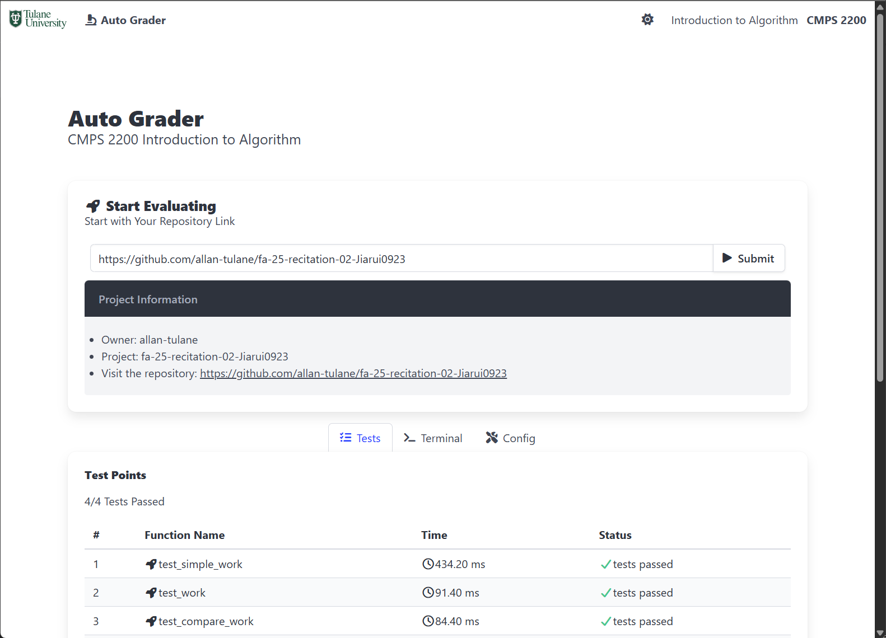

# CMPS2200 AutoGrader

This is an **autograder for `CMPS2200: Introduction to Algorithms`**.

It is a **single-file, server-free autograder** designed for CMPS2200 lab repositories.
The autograder is **configuration-free** but can be customized for special requirements. It uses [`PyScript`](https://pyscript.net/), which allows Python code to run **directly in the browser** using `Pyodide` (Python compiled to WebAssembly).  
This makes it possible to deploy the autograder as a **single HTML page**, running the repository code entirely within the user's browser, **no backend or server required**.

The autograder is also available online and can be accessed directly at:  
👉 [CMPS2200 Autograder](https://www.jiarui-li.com/CMPS2200-AutoGrader/grader.html)



## Usage Guidelines for Students

This section introduces the **main functions**, **issue reporting**, and **extended functions** of the autograder.  
Completing the first section is enough to start using the autograder.  

If you encounter an error, please check the [Common Issues](#common-issues) section first.  
If the issue is not resolved, follow the **Issue Reporting** instructions.


### How to Test Your Code

1. Go to your repository page and copy the repository link or clone link.  
   - Repository link format:  
     `https://github.com/{account_name}/{repository_name}/(tree/main/)`  
   - Git clone link format:  
     `https://github.com/{account_name}/{repository_name}.git`  
   - **Make sure your repository is public.**
2. Paste the link in the autograder, then click **Submit** or press **Enter**.
3. Wait a few seconds — the **Test Points** panel will display:
   - Passed tests  
   - Failed tests  
   - Execution time  

⚠️ **Important:** The autograder runs **entirely in your own browser**.  
Your tests and submissions are **not visible** to your professor or TA.


### How to Identify and Report an Issue

If an error occurs:

1. Open the **Terminal** tab and check the error message.  
2. Look for possible solutions in the [Common Issues](#common-issues) section.  
3. If the issue persists, report it by following these steps:  
   - Go to the **Config** tab and copy all configuration information into your email.  
   - Go to the **Terminal** tab and copy the **error message only** into your email.  
   - Include a **short description** of the issue along with the copied information.


### Extended Functions

#### History
- The **History** panel shows all your past evaluation records.  
- Records are stored **locally** in your browser.  
- Records will be lost if you switch browsers, change computers, or clear browser data.  
- You can manually remove all records by clicking **Clear**.

#### Theme
- The autograder supports both **light** and **dark** themes.  
- By default, the theme is set to **Auto**, following your system preference.  
- You can manually switch themes using the **theme toggle button** in the navigation bar, next to *Introduction to Algorithms*.


## Common Issues
### File Not Found
This error may occur for the following reasons:
1. Your repository is **private** — please make it **public**.  
2. The repository link is **incorrect** — double-check the URL.  
3. Required files are missing — your repository must contain at least:  
   - `main.py`  
   - `test_main.py`  
4. Files are inside an extra folder — make sure they are located in the **root directory** of your repository. 

### Package Missing
If you see errors related to missing packages:
- Ensure that a `requirements.txt` file is included in your forked or copied repository.


## Customize Configuration
This section is intended for **course tutors** who want to customize the autograder.  

By default, the autograder works as a standalone HTML file (`grader.html`).  
For customization, a `config.js` file can be provided in the same path.  
If `config.js` is not found, the autograder falls back to its default configuration.  

### Configure Autograder
The config file consists of three parts:

- **`test_file`** — the test file for PyTest  
- **`files`** — the list of files imported by the test file  
- **`python_packages`** — the required Python packages  

#### Test File
```javascript
const test_file = "test_main.py";
```
- This is the main entry point for PyTest.
- By default, it is `test_main.py`.
- You can change it if your test file has a different name.

The autograder will automatically scan all functions in this file and execute them, equivalent to: 
```bash
pytest {test_file}::{function}
```

#### Files
```javascript
const files = [
    "main.py"
];
```
- This is the list of files imported by `test_main.py`.
- By default, it includes only `main.py`.
- Make sure to list all files explicitly — including submodules.
    - ✅ Example: include `utils/file.py`
    - ❌ Do not just include `utils/`

#### Requirements
```javascript
const python_packages = [
    "pytest"
];
```
- If the repository contains a `requirements.txt`, this parameter is ignored.
- The autograder will automatically install dependencies from `requirements.txt`.
- If `requirements.txt` is missing, configure the required packages here.
    You can specify packages by name, version, or repository path:
    ```javascript
    const python_packages = [
        "pytest",
        "{package}=={version}", // with version
        "{package}@{repository path}", // with repository link
    ];
    ```
⚠️ Do not remove `pytest` from this list — it is required.

### Deployment
There are multiple ways to run the autograder:
1. Local File  
   Open `grader.html` directly in your web browser.
2. Deploy as a static page  
   Serve `grader.html` with a static web server (e.g., NGINX, Apache).
3. Deploy to GitHub page  
   - Host `grader.html` as a GitHub Page or subpage.
   - Ensure that your GitHub framework does not re-render it.
     For example, with Hexo, add the following header at the beginning of grader.html to prevent rendering:
    ```html
    layout: false
    ---
    ```

## Cite & Support
If you need further support, customization, or find any bugs, please either:  
- Open an issue in this repository, or  
- Contact **Jiarui Li** at *jli78@tulane.edu*  

If you would like to reference this repository, please cite it as:  
```bibtex
@misc{CMPS2200_AutoGrader,
  title        = {CMPS2200-AutoGrader: An autograder for CMPS2200 Introduction to Algorithms},
  howpublished = {\url{https://github.com/Jiarui0923/CMPS2200-AutoGrader}},
  year         = {2025},
  note         = {GPL-3.0 License},
}
```

## Acknowledgement
This autograder imported packages via public CDNs:
- [PyScript](https://pyscript.net/): In-browser Python script interpreting.
  ```html
  <script type="module" src="https://pyscript.net/releases/2025.7.3/core.js"></script>
  <link rel="stylesheet" href="https://pyscript.net/releases/2025.7.3/core.css">
  ```
- [Bulma](https://bulma.io/): CSS framework.
  ```html
  <link rel="stylesheet" href="https://cdn.jsdelivr.net/npm/bulma@1.0.4/css/bulma.min.css">
  ```
- [Font Awsome](https://fontawesome.com/): CSS icons.
  ```html
  <link rel="stylesheet" href="https://cdnjs.cloudflare.com/ajax/libs/font-awesome/7.0.1/css/all.min.css"/>
  ```
